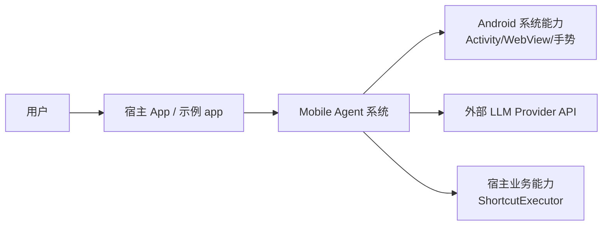
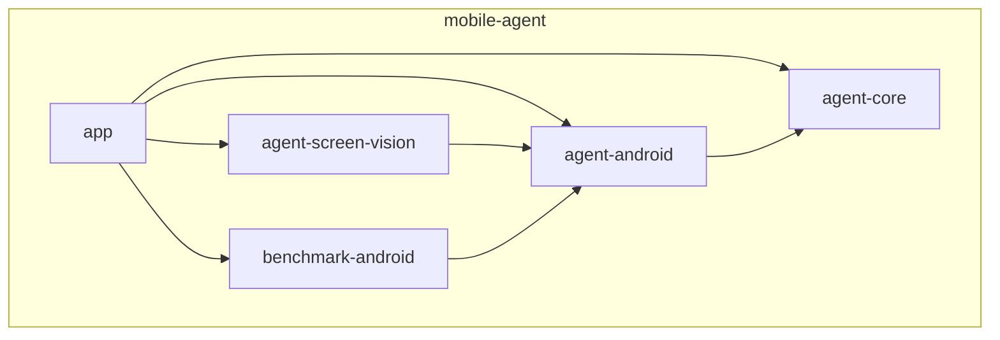
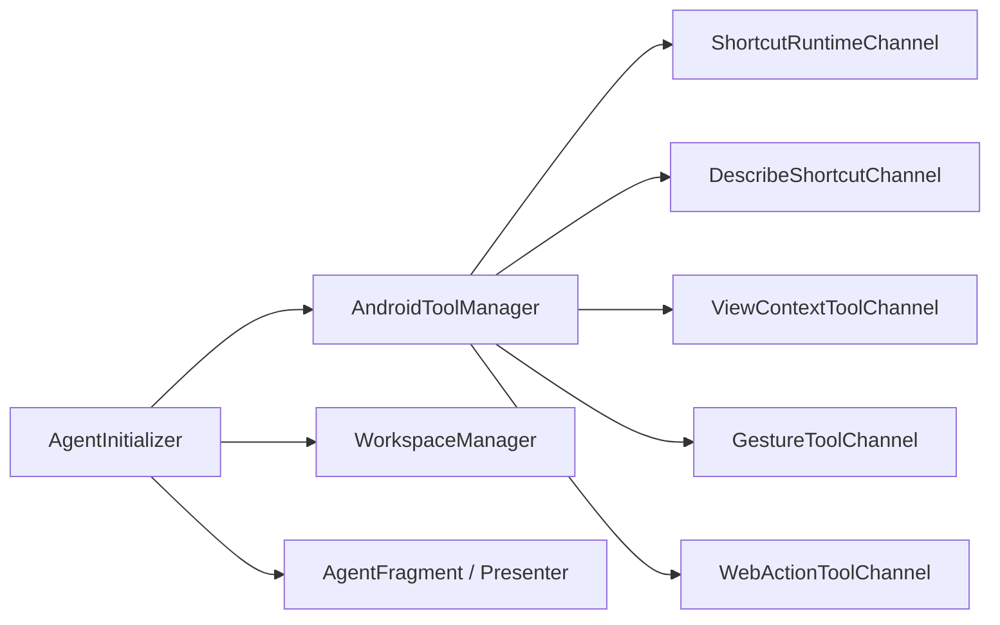
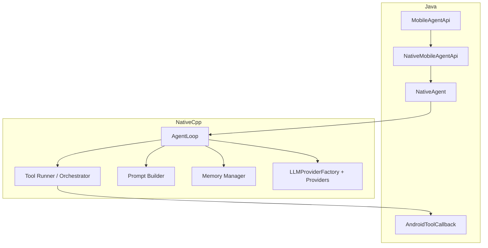
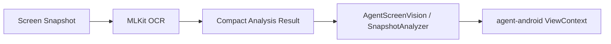
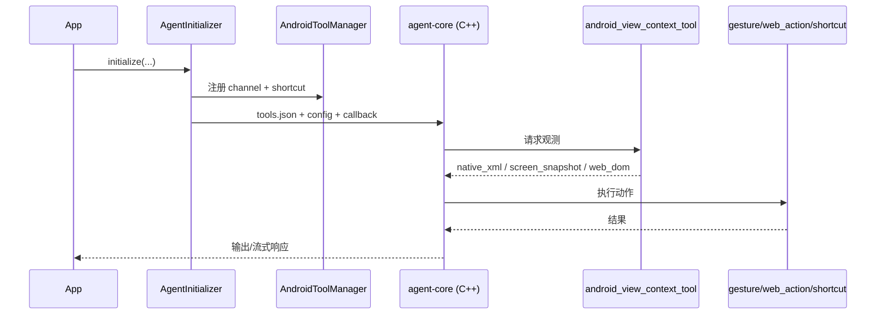

# Mobile Agent C4 架构设计（Context / Container / Component）

> 面向当前 `mobile-agent` 项目的标准化 C4 输出，便于评审与对外同步。

---

## C1 - Context（系统上下文）

### 目标

`mobile-agent` 是一个面向 Android 的端侧 Agent 系统：

- 宿主 App 承载业务与 UI
- Agent 负责理解用户意图、观测页面、调用工具并执行动作
- 能力核心由 `agent-core`（推理/调度）与 `agent-android`（Android 执行与集成）组成
- `agent-screen-vision` 提供视觉增强能力

### C1 图

### 关键关系

- 宿主通过初始化入口与 shortcut 注册把业务能力接入 Agent。
- Agent 对页面观测支持 `native_xml / screen_snapshot / web_dom` 三源。
- 根据页面类型分流到 `android_gesture_tool` 或 `android_web_action_tool`。

---

## C2 - Container（容器）

### 容器清单

1. **app（示例宿主）**
   - 装配依赖，承载演示页面和接入代码。
2. **agent-android（Android 集成容器）**
   - 初始化、工具通道、对话 UI、路由与执行编排。
3. **agent-core（核心引擎容器）**
   - Java API + JNI + C++ Agent runtime。
4. **agent-screen-vision（视觉容器）**
   - OCR/截图分析/紧凑页面语义。
5. **benchmark-android（评测容器）**
   - 基准任务触发与验证。

### C2 图

### 职责边界

- `agent-core`：负责决策与调度（何时调用工具、如何推进 AgentLoop）。
- `agent-android`：负责 Android 侧执行（工具具体如何落地）。
- `agent-screen-vision`：提供视觉语义补充，不替代原生 DOM/XML。

---

## C3 - Component（组件）

## C3.1 `agent-android` 组件

**说明**

- `AgentInitializer`：装配入口，负责 config/workspace/native 初始化。
- `AndroidToolManager`：聚合 tool schema、接收 native 回调、路由 channel。
- channel 分两类：
  - 业务：`run_shortcut`、`describe_shortcut`
  - 页面：`android_view_context_tool`、`android_gesture_tool`、`android_web_action_tool`

## C3.2 `agent-core` 组件（Java + Native）

**说明**

- Java 层提供稳定接口与 JNI 桥。
- C++ 层负责主循环、推理调度、工具编排、memory 与 provider 适配。

## C3.3 `agent-screen-vision` 组件

**说明**

- 作为 `agent-android` 的视觉增强输入。
- 与 `native_xml` / `web_dom` 并列为观测源。

---

## 端到端链路（补充）

---

## 一句话结论

该项目通过 `agent-core`（决策大脑）与 `agent-android`（执行总线）解耦模型决策与端上执行，借助 `agent-screen-vision` 增强观测，形成可扩展的移动端 Agent 闭环。
