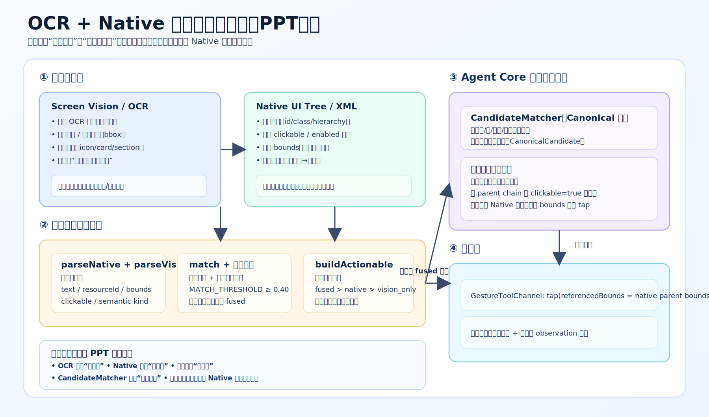

# OCR + Native 融合点击功能架构图（PPT版）

下图用于展示项目中“视觉识别 + Native 结构融合”的点击决策主链路：

- OCR/视觉：提供可见文本与视觉区域。
- Native XML：提供稳定结构、可点击状态与真实 bounds。
- Hybrid Observation：融合后产出高置信 `fused` 候选。
- CandidateMatcher：做父子节点归一化合并。
- 执行层：最终点击 Native 可点击父容器。

> 建议直接将 SVG 拖入 PPT（矢量不失真），或导出 PNG 用于固定比例排版。
